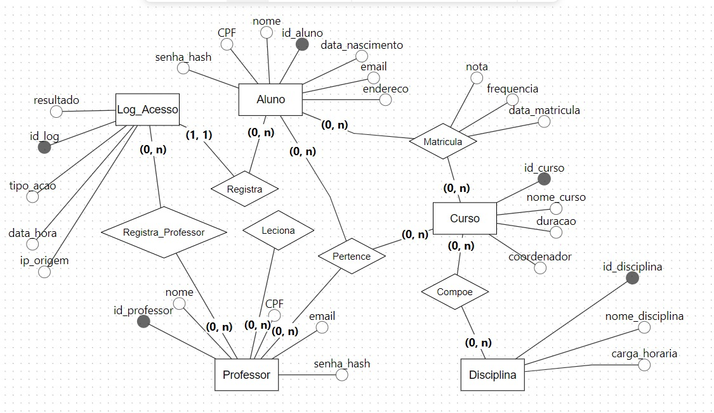

# Diário de Bordo — Tema 3: Segurança de Banco de Dados

**Disciplina:** Projeto de Banco de Dados
**Data:** 12/08/2026
**Equipe:** Rafael Piasentin, Bruno Parente, Eduardo Fuse

## 1. Resumo

### 1.1 Pilares da Segurança

A segurança de um banco de dados pode ser compreendida por meio da tríade **CID**:

- **Confidencialidade:** somente pessoas autorizadas podem acessar os dados.
- **Integridade:** os dados devem estar corretos e não podem ser alterados de forma indevida.
- **Disponibilidade:** o sistema deve permanecer em funcionamento e acessível para os usuários autorizados.

Também foi abordada a **Regra de Anderson**, segundo a qual existe um equilíbrio entre segurança e facilidade de uso: quanto mais acessível for o sistema, maior tende a ser o risco de segurança; por outro lado, quanto mais protegido, maiores tendem a ser as restrições impostas aos usuários.

### 1.2 Criptografia

A criptografia é um mecanismo de proteção de dados que os transforma em um formato ilegível sem a posse da chave correta. Pode ser aplicada tanto aos **dados armazenados no banco** quanto aos **dados em trânsito na rede**.

As senhas, em particular, nunca devem ser armazenadas em texto puro — para isso, utiliza-se normalmente uma função de **hash**.

Também foi estudado o conceito de **mascaramento de dados**, técnica utilizada para ocultar parte de uma informação sensível (por exemplo, exibir apenas os últimos dígitos de um CPF).

A criptografia funciona como uma camada adicional de proteção: mesmo que um agente não autorizado consiga acessar o banco, os dados protegidos permanecem inutilizáveis sem a chave necessária.

### 1.3 Controle de Acesso e Modelagem

A segurança também influencia diretamente na forma como o banco de dados é modelado. Entre as práticas discutidas, destacam-se:

- Criação de diferentes **perfis de usuário**, como Aluno, Professor e Administrador, cada um com permissões distintas;
- Separação de informações sensíveis em tabelas específicas, restringindo o acesso a elas;
- Implementação de **logs de auditoria**, responsáveis por registrar as ações realizadas no sistema, permitindo identificar quem realizou determinada alteração e quando ela ocorreu.

Exemplos de campos úteis para auditoria:

- `criado_por`
- `alterado_por`
- `data_alteracao`

---

## 2. Laboratório Prático

O laboratório permitiu compreender, na prática, como a segurança pode ser aplicada em um banco de dados — principalmente por meio de permissões de acesso, proteção de informações e registro das alterações realizadas.

A principal conclusão foi a de que não basta apenas criar as tabelas e inserir os dados; é necessário também definir **quem pode acessar cada informação** e **o que cada usuário está autorizado a fazer**.

---

## 3. Auditoria e Privacidade

### 3.1 Atributos com Dados Sensíveis

| Entidade | Atributo Sensível | Justificativa |
|----------|-------------------|----------------|
| Aluno    | CPF                | Trata-se de um dado pessoal que precisa ser protegido. |

### 3.2 Tabelas que Necessitam de Log de Acesso

| Tabela    | Justificativa |
|-----------|----------------|
| Professor | Alterações em notas precisam ser registradas para identificar quem realizou a alteração e em que momento ela ocorreu. |

---

## 4. Referência Bibliográfica

HEUSER, Carlos Alberto. **Projeto de Banco de Dados**. Bookman.